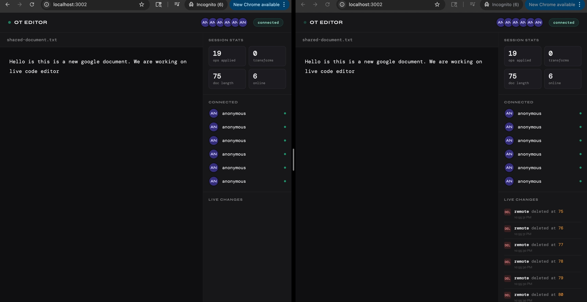

# OT Editor

A real-time collaborative text editor built from scratch using **Operational Transformation (OT)** — the same algorithm that powers Google Docs.

> Built as a deep-dive into how real-time collaboration actually works under the hood, not just as a tutorial exercise.

---

## Demo

> _Open two browser tabs side by side, type in one, watch the other sync in real time._



---

## How it works

Most people use collaborative editors every day but few understand what happens when two people type at the same time. This project implements the core algorithm from scratch.

### The problem

Say two users both see the document `"cat"` and type simultaneously:

```
User A: insert 'x' at position 0  →  "xcat"
User B: insert 'y' at position 0  →  "ycat"
```

If you apply both naively you get `"xycat"` on one client and `"yxcat"` on another. The documents diverge. OT solves this.

### The solution

When operations conflict, **transform** adjusts positions before applying:

```
User B's op arrives at server after User A's op is already applied
→ transform("insert y at 0") against ("insert x at 0")
→ adjusted op: "insert y at 1"
→ result on both clients: "xycat" ✓
```

### Architecture

```
┌─────────────┐     op + clientVersion      ┌─────────────────┐
│  Client A   │ ─────────────────────────▶  │                 │
│  (browser)  │                             │   WebSocket     │
└─────────────┘                             │   Server        │
                                            │                 │
┌─────────────┐     op + clientVersion      │  1. find missed │
│  Client B   │ ─────────────────────────▶  │     ops         │
│  (browser)  │                             │  2. transform   │
└─────────────┘                             │  3. apply       │
                                            │  4. broadcast   │
┌─────────────┐ ◀──────────────────────     │                 │
│  Client C   │   transformed op            └─────────────────┘
│  (observer) │
└─────────────┘
```

### Version numbers

Every client tracks which version of the document they were on when they typed. The server uses this to figure out which ops the client missed and transforms the incoming op against each one before applying it.

```
Client was on version 3
Server is now on version 6
→ client missed ops 4, 5, 6
→ incoming op is transformed against each missed op in order
→ result is applied and broadcast
```

---

## Features

- **Real-time sync** — changes appear instantly across all connected clients
- **Operational Transformation** — concurrent edits are correctly reconciled
- **Live presence** — see who is connected, with avatars and names
- **Live changes feed** — every insert and delete logged in real time with position and author
- **Session stats** — ops applied, transforms run, document length tracked live
- **Typing indicator** — shows when another user is actively editing
- **Graceful reconnect** — client automatically retries if server connection drops

---

## Project structure

```
ot-editor/
  src/
    core/
      operation.js      # operation data model
      transform.js      # OT transform function — the heart of the system
      apply.js          # applies an op to a document
      document.js       # document model
    server/
      server.js         # WebSocket server, message handling
      client_manager.js # tracks connected clients
    client/
      index.html        # markup
      client.js         # WebSocket client, UI logic
      styles.css        # styling
  package.json
  README.md
```

---

## Getting started

### Prerequisites

- Node.js 18+
- npm

### Install

```bash
git clone https://github.com/yourusername/ot-editor.git
cd ot-editor
npm install
```

### Run

```bash
# terminal 1 — start the WebSocket server
npm start

# terminal 2 — serve the client
npx serve client/ -l 3002
```

Then open `http://localhost:3002` in two browser tabs and start typing.

---

## Core modules

### `transform(op1, op2)`

The most important function in the project. Takes two concurrent operations and adjusts `op2` assuming `op1` has already been applied.

| op1 | op2 | behaviour |
|-----|-----|-----------|
| insert at pos X | insert at pos ≥ X | op2.pos shifts right by 1 |
| insert at pos X | delete at pos ≥ X | op2.pos shifts right by 1 |
| delete at pos X | insert at pos > X | op2.pos shifts left by 1 |
| delete at pos X | delete at pos > X | op2.pos shifts left by 1 |
| delete at pos X | delete at pos X | op2 becomes a no-op |

### `apply(doc, op)`

Applies a transformed op to the document. Checks `op.noOp` first — if true, returns the document unchanged.

### `ClientManager`

Wraps a `Map` of connected clients. Handles add, remove, broadcast, and presence updates. Server never touches the raw client list directly.

---

## What I learned

- How OT works at the algorithm level — transform functions, version vectors, server serialization
- Why a central server simplifies OT dramatically compared to peer-to-peer
- The difference between transient state (who is connected) and persistent state (the document)
- WebSocket lifecycle — how a single server handles many concurrent long-lived connections
- Separating concerns cleanly — operation model, transform logic, apply logic, and server are all independent modules

---

## Possible extensions

- [ ] Persist document to disk so it survives server restarts
- [ ] Replay mode — watch the document being built op by op from the beginning
- [ ] Rooms — multiple documents each with their own channel
- [ ] Undo support — reverse ops per client
- [ ] Cursor presence — show each user's cursor position in the editor
- [ ] REST endpoint `GET /history` returning the full op log

---

## References

- [Operational Transformation — Wikipedia](https://en.wikipedia.org/wiki/Operational_transformation)
- [Google's paper on OT in Wave](https://svn.apache.org/repos/asf/incubator/wave/whitepapers/operational-transform/operational-transform.html)
- [Understanding OT — Joseph Gentle](https://josephg.com/blog/crdts-are-the-future/)

---

## License

MIT